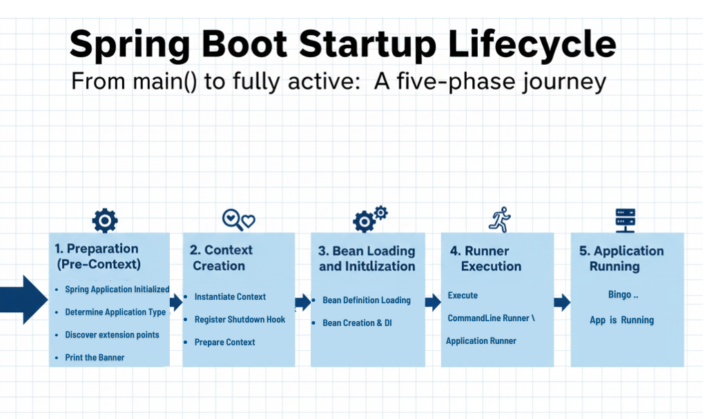
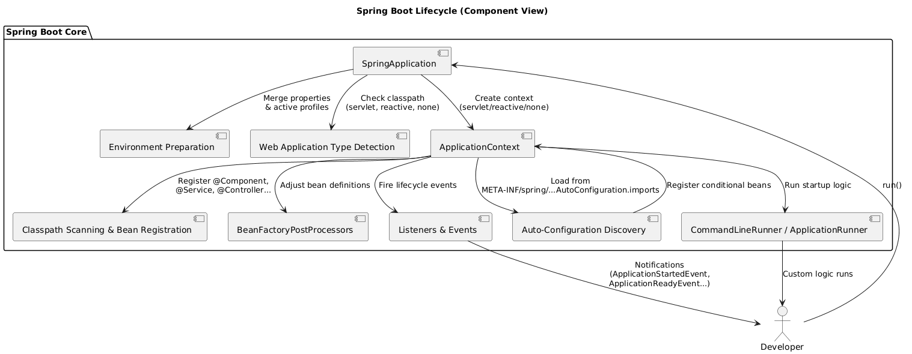
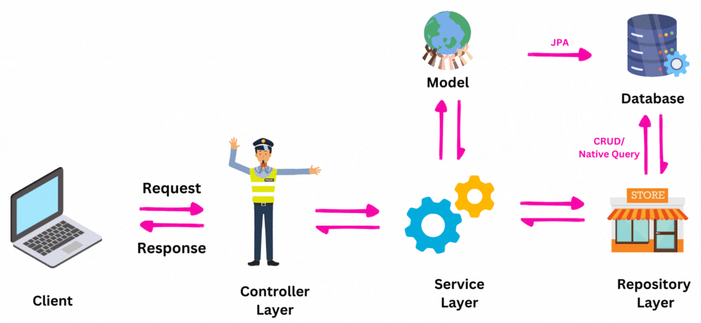
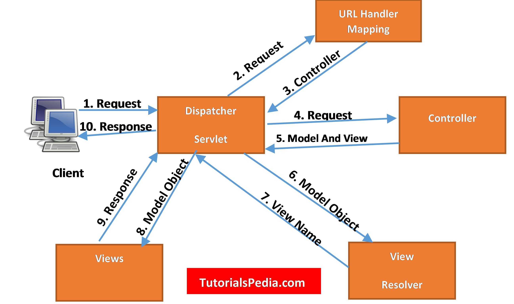

## Spring Boot Startup Process (End-to-End Deep Dive)






### Why Startup Process Matters
Most Spring bugs are not coding bug:

They are startup-time bugs:
* Bean not created
* Dependency not injected
* Auto-config didn't trigger
* Circular dependency failure
* Wrong order of initialization

Must know what happens between;
```java
public static void main(String[] args)
```
and
```text
Application started successfully
```

### high-level Startup Flow
```text
main()
 ↓
SpringApplication.run()
 ↓
Prepare environment
 ↓
Create ApplicationContext
 ↓
Load bean definitions
 ↓
Apply auto-configuration
 ↓
Instantiate beans
 ↓
Inject dependencies
 ↓
Initialize beans
 ↓
Application ready
```

### Step-by-Step Deep Dive

#### Step 1: `main()` Method

```java
import org.springframework.boot.SpringApplication;
import org.springframework.boot.autoconfigure.SpringBootApplication;

@SpringBootApplication
public class MyApp {
    public static void main(String[] args) {
        SpringApplication.run(MyApp.class, args);
    }
}
```
At this point:
* No beans exist
* No container exists
* No auto-config exists

This is pure java execution.

#### Step 2: `SpringApplication.run()`
This method  orchestrates the entire startup

Internally it:
* Determines application type(web/reactive/ non-web)
* Loads environment
* Creates Application context
* Triggers refresh

Think of it as startup coordinator, not container itself.

#### Step 3: Environment preparation
Spring Boot now prepares the Environment

Sources load (in order):
1. Command-line args
2. JVM System properties
3. OS environment variables
4. `application.properties / yaml`
5. profile-specific properties

This decide:
* Which profiles are active
* Which auto-configs activate
* Which beans gets created

Environment is ready before beans exist.

#### Step 4: ApplicationContext Creation
Based on application type:

| App Type      | Context                                              |
| ------------- | ---------------------------------------------------- |
| Web (Servlet) | `AnnotationConfigServletWebServerApplicationContext` |
| Reactive      | `ReactiveWebServerApplicationContext`                |
| Non-web       | `AnnotationConfigApplicationContext`                 |

At this Stage:
* container exists
* No beans yet

#### Step : Load Primary Configuration Class
Spring now processes:

```java
import org.springframework.boot.autoconfigure.SpringBootApplication;
@SpringBootApplication
```
Which expands to :
1. @SpringBootConfiguration
2. @EnableAutoConfiguration
3. @ComponentScan

This step registers bean definitions, not objects.

#### Step 6: Component Scanning
Spring scans:
* Your base package
* Sub-packages

It finds:
* `@Component`
* `@Service`
* `@Repository`
* `@Controller`
* `@Configuration`

Each discovered class becomes a Bean definition.

Still no Objects created.

#### Step 7: Auto-configuration Import(critical)
Now spring Boot Processes:
```@EnableAutoConfiguration```
It :
* It reads `AutoConfiguration.imports`
* loads auto-config classes
* Registers bean definitions

user beans override auto-beans here.

#### Step 8: Context Refresh (The big Step)
This is where everything becomes real.

Spring calls:
```ApplicationContext.refresh()```

Inside refresh:
```text
1. instantiate singleton beans
2. Resolve dependencies
3. Apply beanpostProcessors
4. Call init methods
5. Publish context events
```

This is the heart of spring.

#### Step 9 : Bean instantiation
For each singleton bean:
1. Constructor called
2. Dependencies resolved
3. Bean instance created

If constructor injection fails --> app fails here.

#### Step 10: Dependency injection
spring injects:
* Constructor args
* Fields (`@Autowired`)
* Setters

This is where:
* Circular dependency errors occur
* Missing bean error occur

#### Step 11: BeanPostProcessors

Before and after initialization:
* AOP proxies created
* `@Transactional` applied
* `@Autowired` finalized

Proxies are created here, not earlier.

#### Step 12: Initialization Callbacks
Spring now calls:
* `@PostConstruct`
* `afterPropertiesSet()`
* Custom init methods.

Beans are now fully ready.

#### Step 13: ApplicationReadyEvent
finally:
* Context is ready
* Embedded server started
* App can handle requests

This is where:
```text
@EventListener(ApplicationReadyEvent.class)
```
fires.

### Problems 
#### problem 1 : Bean Used Before fully initialized

```java

import org.springframework.beans.factory.annotation.Autowired;
import org.springframework.stereotype.Component;

@Component
public class CacheLoader {

    @Autowired
    private DataSource ds;
    
    public CacheLoader(){
        ds.getConnection(); //ds is null
    }
}
```

**Why it Breaks**
* Constructor runs before injection
* Dependencies not ready

**Solution**
```java
@PostConstruct
public void init() {
    ds.getConnection();
}
```

#### Problem 2: Auto-configuration Not Triggering

```java
import org.springframework.context.annotation.Bean;

@Bean
public Datasource datasource() {
    return new CustomDataSource();
}
```
Auto-configuration disappears.

Why?
* `@ConditionalOnMissingBean` backs off

**Solution**
Understand override behaviour -- not a bug.

#### Problem 3: Circular Dependency Crash

```java
@Service
class A {
    A(B b) {}
}

@Service
class B {
    B(A a) {}
}
```
Fails at bean instantiation phase.

**Solution**
* Redesign
* Break dependency
* Use provider (temporary fix)

#### Problem 4: `@Bean` Called Manually
```java
Engine e = appConfig.engine();
```

**Solution**
Always inject via container

### Debugging startup issues
enable:

```properties
debug =true
```
Also useful:
```properties
logging.level.org.springframework =DEBUG
```
Watch for:
* Bean creation order
* Condition failure
* Proxy creation

