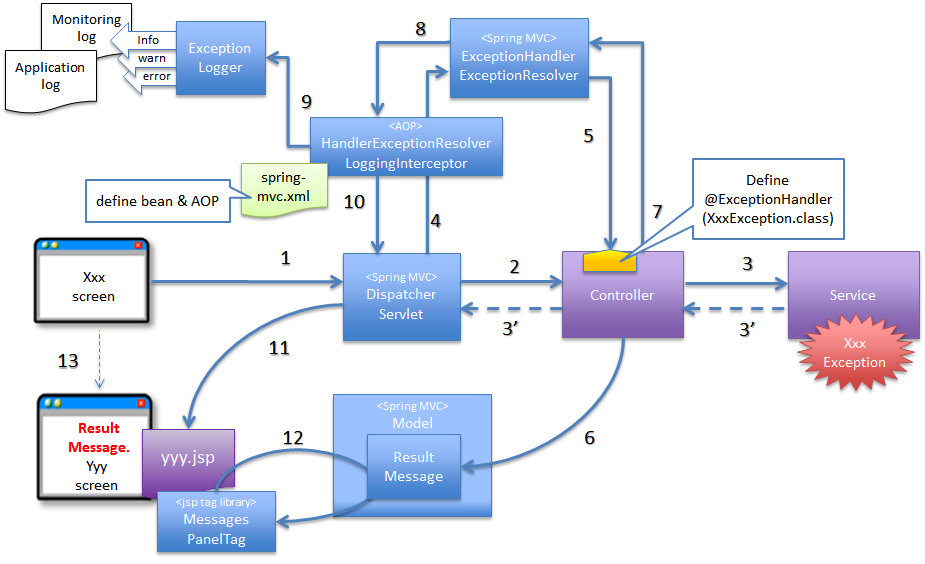

## Exception Handling in Spring REST APIs



### Why Exception Handling matters in REST APIs

In REST APIs:
* Exception are part of API contract
* Clients depend on status codes + error format
* Poor handling causes:
  * 500 errors everywhere
  * HTML error pages
  * Sensitive info leakage
  * Impossible debugging

A REST API without proper exception handling is not production-ready


### Default Spring Behavior (What happens if you do nothing)
Default Scenario
````java
@GetMapping("/orders/{id}")
public Order get(@PathVariable Long id) {
    return repo.findById(id).get(); // throws NoSuchElementException
}

````
Response:
* status 500
* Body : HTML error page or generic JSON

Problems
* Wrong HTTP status (should be 404)
* No Structured error
* Client has no clue what went wrong

### How Spring Handles Exceptions internally
When an exception occurs:
```
Controller
 ↓ throws exception
DispatcherServlet
 ↓
HandlerExceptionResolver chain
 ↓
Resolved response OR default error
```
Spring uses multiple resolvers:
1. ExceptionHandlerExceptionResolver
2. ResponseStatusExceptionResolver
3. DefaultHandlerExceptionResolver

### Local Exception Handling (`@ExceptionHandler`)
```java
@RestController
public class OrderController {

    @ExceptionHandler(NoSuchElementException.class)
    public ResponseEntity<String> handle(NotFoundException e) {
        return ResponseEntity.status(404).body("Order not found");
    }
}
```
Limitations
* Works only for this controller
* Duplicates logic across controllers
* not Scalable


### Global Exception Handling (`@ControllerAdvice`)

This is the correct production approach

```java
@RestControllerAdvice
public class GlobalExceptionHandler {

    @ExceptionHandler(NoSuchElementException.class)
    public ResponseEntity<String> handleNotFound(Exception e) {
        return ResponseEntity.status(HttpStatus.NOT_FOUND)
                             .body("Resource not found");
    }
}
```
* Applies to all controllers
* Centralized 
* Clean

### Problem 1: returning Strings instead of Error Objects
problematic code

```java
import org.springframework.http.ResponseEntity;

return ResponseEntity.status(404).body("Order not found")
```
Why this is Bad
* No error code
* No timestamp
* No traceability
* Inconsistent format

**Solution: Standard Error Response DTO**
```java
public record ApiError(
    int status,
    String message,
    String path,
    Instant timestamp
) {}

```
```java

@ExceptionHandler(NoSuchElementException.class)
public ResponseEntity<ApiError> handle(Exception e, HttpServletRequest req) {
    return ResponseEntity.status(404).body(
        new ApiError(404, e.getMessage(), req.getRequestURI(), Instant.now())
    );
}
```

### Mapping Exceptions to HTTP Status Codes

Best Practice Mapping

| Exception          | HTTP Status |
| ------------------ | ----------- |
| Resource not found | 404         |
| Invalid input      | 400         |
| Unauthorized       | 401         |
| Forbidden          | 403         |
| Conflict           | 409         |
| Server error       | 500         |

APIs must respect HTTP semantics

### Problem 2: Using Generic `Exception` Everywhere
Problematic code
```java
@ExceptionHandler(Exception.class)
public ResponseEntity<ApiError> handle(Exception e) { }
```
Why Dangerous
* Hides real issues
* Breaks debugging
* Masks programming errors


**Solution: Custom Exceptions**

```java

public class OrderNotFoundException extends RuntimeException{
    public OrderNotFoundException(Long id){
        super("Order not found: " + id);
    }
}
```

```java
import org.springframework.http.ResponseEntity;
import org.springframework.web.bind.annotation.ExceptionHandler;

@ExceptionHandler(OrderNotFoundException.class)
public ResponseEntity<APiError> hanlde(OrderNotFoundException e) {
}
```

### `@ResponseStatus`
 
```java
@ResponseStatus(HttpStatus.NOT_FOUND)
public class OrderNotFoundException extends RuntimeException { }

```

Spring automatically returns:
* status 404
* Reason message

Limitation:
* less control over response body

### Problem 3: Validation Errors Look Ugly
Default Validation Response
````json
{
  "timestamp": "...",
  "status": 400,
  "error": "Bad Request",
  "path": "/orders"
}
````
No field-level details.

**Solution: Handle `MethodArgumentNotValidException`**

```java
@ExceptionHandler(MethodArgumentNotValidException.class)
public ResponseEntity<Map<String, String>> handleValidation(
        MethodArgumentNotValidException ex) {

    Map<String, String> errors = new HashMap<>();
    ex.getBindingResult().getFieldErrors()
      .forEach(e -> errors.put(e.getField(), e.getDefaultMessage()));

    return ResponseEntity.badRequest().body(errors);
}
```
### Problem 4: Stack Traces Leaked to client
Dangerous Response
```json
{
  "exception": "NullPointerException",
  "stackTrace": [...]
}
```
Why Dangerous
* Security risk
* Reveals internal structure

**Solution**
* Log stack trace internally
* Return sanitized message externally

```java
import org.springframework.http.ResponseEntity;

log.error("Error occured",e);
return ResponseEntity.status(500)
.body(new ApiError(500,"internal server error",....));
```

### handling Spring MVC Exceptions
Spring throws its own exceptions:

| Exception                                 | Meaning          |
| ----------------------------------------- | ---------------- |
| `HttpMessageNotReadableException`         | Invalid JSON     |
| `MethodArgumentTypeMismatchException`     | Wrong param type |
| `MissingServletRequestParameterException` | Missing param    |

you must handle these explicitly

### Order of Exception Resolution
Spring resolves exceptions in this order:
1. `Exceptionhandler` (controller)
2. ControllerAdvice
3. ResponseStatus
4. Default handlers

Closest handler wins.

### Problem 5: Exception handler Not triggered

Causes:
* Exception handled earlier
* Wrong exception type
* Advice not scanned
* Package mismatch

Fix checklist
* @RestControllerAdvice
* Correct exception class
* Same or parent package
* No swallowing exceptions


### Best Practice 
* Use Custom Exceptions
* Centralize handling
* Standardize error response
* Log once, response once
* Never expose stack traces
* Match HTTp semantics


