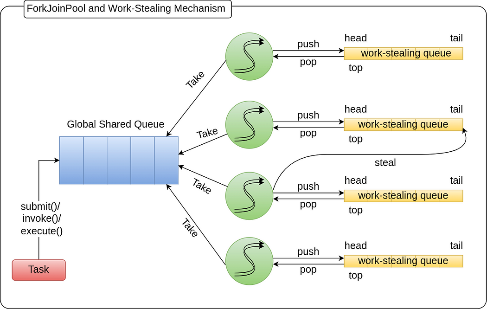
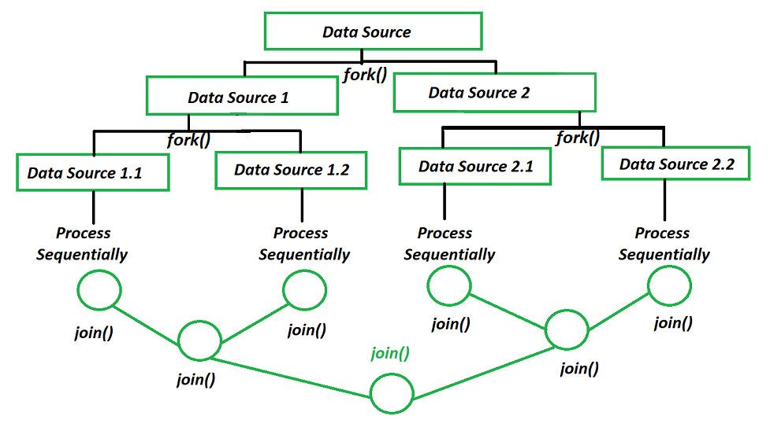

### ForkJoinPool, Parallelism & the CommonPool Trap

Parallelism is about CPU usage, not about more threads.

#### What is ForkJoinPool?

ForkJoinPool is a specialized thread pool designed for CPU-bound, recursive, divide-and-conquer tasks using work stealing.

It was introduced to:
* Efficiently use all CPU cores 
* Reduce contention
* Minimize idle threads

#### Fork-Join Mental Model (Divide & Conquer)



How it Works
1. Task splits into subtasks (fork)
2. Subtasks run in parallel
3. Results are combined (join)

Each worker thread:
* Has its own deque
* Steals work from others when idle

#### Why ForkJoinPool Exists (CPU Reality)
Normal Thread Pool Problem
* Threads block
* CPU cores go idle
* Throughput drops

ForkJoinPool Solution
* Tasks are small
* Threads are busy 
* Idle threads steal work

* Maximum CPU utilization
* Minimal context switching

#### Parallel != Concurrency 

| Concept     | Meaning                                 |
| ----------- | --------------------------------------- |
| Concurrency | Multiple tasks making progress          |
| Parallelism | Multiple tasks executing simultaneously |

ForkJoinPool is about parallelism.

#### ForkJoinPool Thread Count
Default size

```text
parallelism = number of CPU cores - 1
```
Example:
* 8-core machine 
* ForkJoinPool size = 7 

One core left for:
* Main thread
* GC
* OS work

#### The CommonPool
What is CommonPool?
```text
ForkJoinPool.commonPool();
```

Used automatically by:
* `CompletableFuture.supplyAsync()`
* Parallel streams (`stream().parallel()`)

You use it even when you don't realize it

#### Failing code #1 -- Blocking inside CommonPool 
```java
CompletableFuture
    .supplyAsync(() -> {
        Thread.sleep(2000);//blocking
        return "done";
        })
                .thenAccept(System.out::println);
```
What Goes Wrong
* forkJoin threads block
* No threads left to steal work
* CPU idle but system stuck
* Other async tasks starve

This is a production killer

#### Why Blocking is Toxic For ForkJoinPool

ForkJoin Pool assumes
* Tasks are short
* Tasks are CPU-bound
* Tasks do not block

Blocking breaks the model

#### Failing Code #2 -- Parallel Stream 
```java
list.parallelStream()
.forEach(item ->{
    callRemoteService(item); //IO
        })
```
Symptoms
* Random slowness
* Thread starvation
* Unpredictable latency
* Works in dev, fails in prod

#### Correct Rule
**Never perform blocking IO in ForkJoinPool/commonPool**

Use Custom Executor
```java
ExecutorService ioPool =
    Executors.newFixedThreadPool(20);

CompletableFuture
    .supplyAsync(() -> callRemoteService(), ioPool)
    .thenAccept(System.out::println);
```
* IO threads block safely
* CPU pool remains healthy

#### ForkJoinPool Use Cases
* CPU-heavy calculations
* Recursive algorithms
* Parallel streams on in-memory data
* Data transformation
* Map-reduce style logic

#### When not to use ForkJoinPool
* Database calls
* REST calls
* File IO
* Kafka polling
* Blocking waits

#### CommonPool Vs Threadpool

| Aspect             | ForkJoinPool | ThreadPoolExecutor |
| ------------------ | ------------ | ------------------ |
| Task type          | CPU-bound    | IO / mixed         |
| Thread count       | Fixed        | Configurable       |
| Blocking tolerance | ❌            | ✅                  |
| Work stealing      | ✅            | ❌                  |
| Back-pressure      | ❌            | ✅                  |

#### Failing Code #3 - Hidden CommonPool usage
```java
CompletableFuture
    .supplyAsync(() -> heavyIO()) // commonPool 
    .thenApply(result -> process(result))
    .thenAccept(System.out::println);
```
Why this is dangerous
* you didn't choose the pool
* you don't control thread count
* you don't control blocking

**Correct Version**
```java
CompletableFuture
    .supplyAsync(() -> heavyIO(), ioExecutor)
    .thenApplyAsync(result -> process(result), cpuExecutor)
    .thenAcceptAsync(System.out::println, cpuExecutor);
```
* Explicit control
* Correct resource usage

#### ForkJoinPool Starvation
* all worker threads block
* no free thread to execute stolen tasks
* progress halts

This is worse than deadlock -- it looks alive but isn't

#### Mental Model
* ForkJoinPool is a CPU calculator, not a writer
* Don't make it wait

