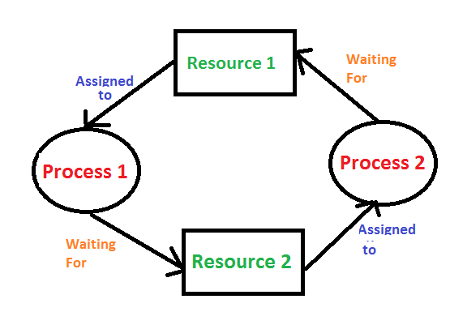

## Deadlocks, Starvation & Livelocks

### Deadlock

A deadlock occurs when two or more threads wait forever for resources held by each other

No CPU spike

No exception

System looks alive but does nothing

### The four Deadlock conditions

Deadlock can occur only if All four are true:
1. mutual Exclusion -- resource held by one thread
2. Hold and wait -- thread holds one resource, waits for another
3. No Preemption -- resource can't be forcibly taken
4. Circular Wait -- cycle of waiting

Break any one -- no deadlock

### Example
```java
class DeadlockDemo {
    static final Object lockA = new Object();
    static final Object lockB = new Object();

    public static void main(String[] args) {
        Thread t1 = new Thread(() -> {
            synchronized (lockA) {
                sleep();
                synchronized (lockB) {
                    System.out.println("Thread 1 acquired both");
                }
            }
        });

        Thread t2 = new Thread(() -> {
            synchronized (lockB) {
                sleep();
                synchronized (lockA) {
                    System.out.println("Thread 2 acquired both");
                }
            }
        });

        t1.start();
        t2.start();
    }

    static void sleep() {
        try { Thread.sleep(100); } catch (Exception ignored) {}
    }
}
```
What Happens
* t1 holds `lockA`, waits for `lockB`
* t2 holds `lockB`, waits for `lockA`
* Deadlock forever

### Visual cycle


### How Deadlocks Appear in Real Systems
Real-world equivalents:
* Nested `synchronized` blocks
* Database row locks
* Kafka consumer + Db transaction
* Cache + DB lock order mismatch
* Microservices with distributed locks

### Deadlock prevention Strategies

#### Lock Ordering

Always acquire locks in the same order
```java
synchronized (lockA) {
    synchronized (lockB) {
        // safe
    }
}
```
Never reverse the  order.

#### Strategy 2: Timeout Locks
Using `tryLock(timeout)` 

Breaks No Preemption condition

#### Strategy 3: Reduce lock scope
Bad:
```java
synchronized void process(){
    callRemoteService(); // IO inside lock
}
```
Good:
```java
void process() {
    callRemoteService();
    synchronized(this) {
        updateState();
    }
}
```

### Starvation -- The Silent Performance Killer

Starvation happens when a thread never gets CPU or locks because others dominate access.

System still works

But some request never finish

### Starvation Example
```java
synchronized void highPriority() {
    while (true) {
        // aggressive loop
    }
}

synchronized void lowPriority() {
    System.out.println("Never executes");
}
```
Causes
* long synchronized blocks
* Unfair locks
* Thread priority misuse
* Busy loops

### How to prevent Starvation
* Short critical sections
* Avoid infinite loops inside locks
* Prefer fair locks
* Avoid thread priorities

### Livelock 

Livelock occurs when threads are active but make no progress because they keep
reacting to each other.

Unlike Deadlock:
* Thread are Runnable
* CPU usage is high
* Still no progress

### Livelock Example
```java
class Livelock {
    static boolean sideA = true;

    static void threadA() {
        while (sideA) {
            sideA =false;
        }
    }

    static void threadB() {
        while (!sideA) {
           sideA=true;
        }
    }
}
```
Both threads:
* keeps yielding
* never proceed

### Deadlock vs starvation Vs livelock

| Problem    | Threads          | CPU    | Progress |
| ---------- | ---------------- | ------ | -------- |
| Deadlock   | BLOCKED          | Low    | ❌        |
| Starvation | RUNNABLE/BLOCKED | Medium | ❌        |
| Livelock   | RUNNABLE         | High   | ❌        |

### Detecting Deadlocks
JVM Tool
```jstack <pid> ```
look for 
``` Found one Java-level deadlock
```
Programmatic detection

```java
import java.lang.management.ManagementFactory;
import java.lang.management.ThreadMXBean;

ThreadMXBean bean = ManagementFactory.getThreadMXBean();

long[] ids = bean.findDeadlockedThreads();
```
### Interview Scenario Question

System is slow, CPU low, no errors, what do you suspect?

Correct answers:
* Deadlock
* Thread pool exhaustion
* blocking in commonPool

### Mental model
Deadlock = waiting forever

Starvation = never getting a turn

livelock = moving but going nowhere


