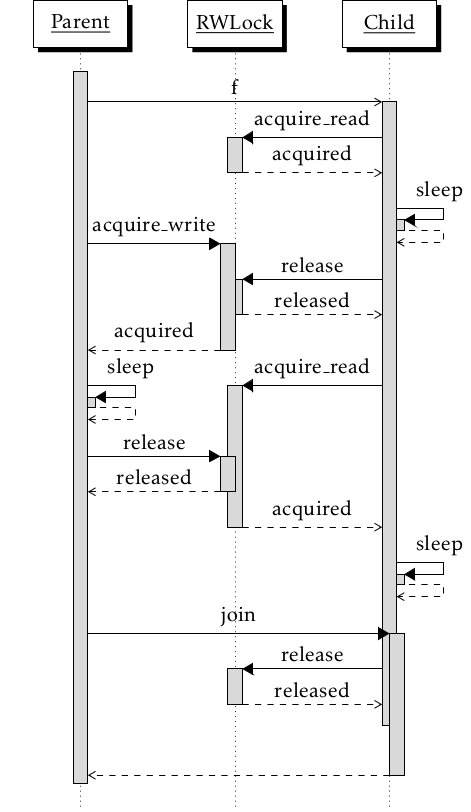
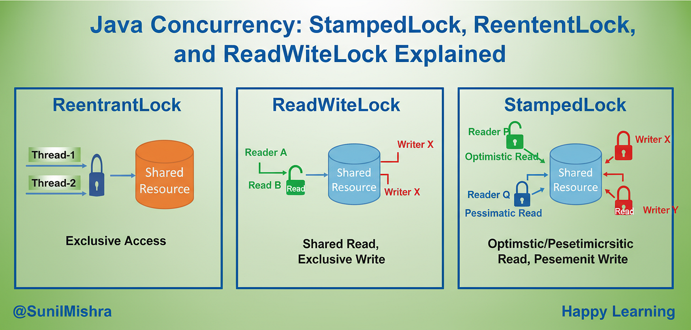

## Explicit Locks API

### Why Explicit Locks Exist
`synchronized` limitations;
* No timeout
* No fairness control
* No non-blocking attempt
* Single condition (`wait/notify`)
* Harder deadlock avoidance

### `ReentrantLock` 
A thread holding a lock can re-acquire it without blocking itself.

Same as `synchronized`, but extra controls.

```java
Lock lock = new ReentrantLock();

lock.lock();

try{
    //critical
}finally{
    lock.unlock();
}
```
Rule: Always unlock in `finally`

### ReentrantLock vs synchronized 

| Feature             | synchronized | ReentrantLock |
| ------------------- | ------------ | ------------- |
| Mutual exclusion    | ✅            | ✅             |
| Visibility          | ✅            | ✅             |
| Fairness            | ❌            | ✅             |
| tryLock()           | ❌            | ✅             |
| Interruptible       | ❌            | ✅             |
| Multiple conditions | ❌            | ✅             |

### Fair vs unfair Locks

Unfair Lock
* threads can barge
* Higher throughput
* Risk of starvation

Fair Lock
* FIFO acquisition
* Slower
* Predictable
```
Lock fairLock = new ReentrantLock(true);
```

Fair locks trade throughput for predictability.

### tryLock() -- Deadlock Avoidance Weapon

Why it matters
* avoids waiting forever
* Enables timeout-based recovery

Example: Deadlock-safe Locking
```java
if (lock.tryLock(100, TimeUnit.MILLISECONDS)) {
    try {
        // safe work
    } finally {
        lock.unlock();
    }
} else {
    // fallback logic
}
```
* Breaks deadlock condition
* Enables retries
* Production-safe

### Interruptible Locking

``` 
lock.lockInterruptibly();
```
If interrupted:
* throws `InterruptedException`
* Thread exits gracefully

`Synchronized` cannot do this

### Conditions - Multiple wait/notify Queues

synchronized Limitation

Only one wait set per monitor

Conditions Fix This
```java
Lock lock = new ReentrantLock();
Condition notEmpty = lock.newCondition();
Condition notFull = lock.newCondition();
```
Producer-Consumer Using Conditions
```java
lock.lock();
try {
    while (queue.isEmpty()) {
        notEmpty.await();
    }
    consume();
    notFull.signal();
} finally {
    lock.unlock();
}
```
* Fine-grained signaling
* No unnecessary wakeups

### ReadWriteLock -- Read Scalability
Problem

Multiple reader block each other with  `synchronized`

Solution

Allow:
* Multiple readers
* Single writer


Usage
```java
ReadWriteLock rw = new ReentrantReadWriteLock();

rw.readLock().lock();
try {
    read();
} finally {
    rw.readLock().unlock();
}

rw.writeLock().lock();
try {
    write();
} finally {
    rw.writeLock().unlock();
}
```
* High read throughput
* Write starvation possible

### When ReadWriteLock Fails
* Read-heavy but frequent writes
* Long read operations
* Writer starvation

This led to StampedLock.

### StampedLock -- High-Performance Reads
Key idea
* optimistic reads
* Validate later
* Lock only if needed

Optimistic Read example

```java
StampedLock lock = new StampedLock();

long stamp = lock.tryOptimisticRead();
int value = data;

if (!lock.validate(stamp)) {
    stamp = lock.readLock();
    try {
        value = data;
    } finally {
        lock.unlockRead(stamp);
    }
}
```
* minimal contention
* Extremely fast reads

### StampedeLock Limitations
* Not Reentrant
* No Condition support
* Easy to misuse
* Complex unlock logic

Use only when performance matters

### Choosing the Right Lock

| Scenario                 | Best Choice   |
| ------------------------ | ------------- |
| Simple mutual exclusion  | synchronized  |
| Timeout / cancellation   | ReentrantLock |
| High read concurrency    | ReadWriteLock |
| Extreme read performance | StampedLock   |
| Deadlock avoidance       | tryLock       |

### Common Mistakes
* Forgetting unlock
* using fair lock unnecessarily
* Overusing StampedeLock
* Mixing synchronized & locks
* Locking too much code

### Mental model

* `synchronized` = safety first
* `ReentrantLock` = control
* `ReadWriteLock` = scale reads
* `StampedLock` = performance at risk