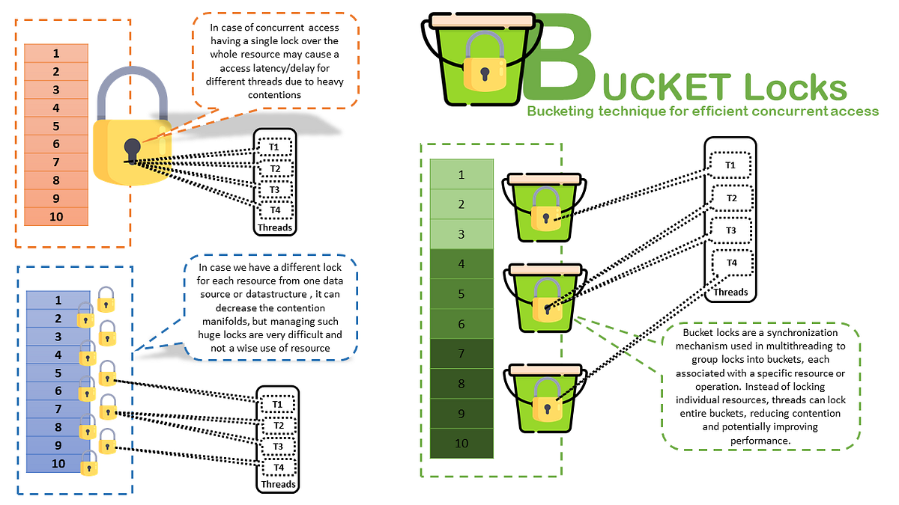

## Concurrent Collections — Internals, Guarantees & Traps

### Why Normal Collections Fail in Concurrency
**HashMap**

```java
import java.util.Map;

Map<Integer, String> map = new HashMap<Integer, String>();

Thread t1 = new Thread(() -> map.put(1,"A"));
Thread t2 = new Thread(() -> map.put(2,"B"));

t1.start();
t2.start();
```
What can go wrong
* Lost updates
* infinite loop (old JDKs)
* Corrupted internal structure
* JVM hang under resize

HashMap is NOT thread-safe  -- ever

First Naive Fix: Collections.synchronizedMap
```java
Map<Integer,String> map = Collections.synchronizedMap(new HashMap<>());
```
* Thread-safe
* Global lock
* Terrible scalability
* Iteration still unsafe without manual locking

### Enter Concurrent Collections
Java provides lock-efficient, scalable collections designed for concurrency.

Main families:
* ConcurrentHashMap
* CopyOnWrite Collections
* Blocking queues
* Concurrent sorted structures

### ConcurrentHasMap -- The workhorse

concurrentHashMap allows concurrent reads and write without locking the entire map.


### How ConcurrentHashMap works
Pre-java 8
* segment-based locking
* Multiple independent locks

Java 8+
* Bucket-level locking
* CAS + synchronized 
* No global lock
* High throughput
* Safe under resize
* Predictable performance

### What ConcurrentHashMap Guarantees
* Thread-safe get/put/remove
* No ConcurrentModificationException
* Weakly consistent iterators
* High concurrency

### What ConcurrentHashMap Does Not guarantee
* Atomicity across multiple operations
* Consistent snapshots
* Lock-free compound logic

### Failing Code #1 -- check-then-act Bug
```java
if(!map.containsKey(key)){
    map.put(key,value);//race condition
        }
```
Why This fails
* Two threads pass containsKey
* Both put 
* Logic breaks

**Correct**
```java
map.putIfAbsent(key,value);
```
or:
```java
map.computeIfAbsent(key,k->value);
```
Use atomic map methods, not external synchronization

### Iteration Behavior

```java
import java.util.Map;
for(Map.Entry<K,V> e : map.entrySet()){
    //safe
        }
```
* No Exception
* May not reflect latest writes
* iterator is weakly consistent
* Safe
* Not snapshot

### CopyOnWrite Collections

What They Are
* CopyOnWriteArrayList
* CopyOnWriteArraySet

on write
* entire array copied
* Readers see old snapshot

**Use Case**
* Ready-heavy
* Rare writes
* No locking during reads

```java
CopyOnWriteArrayList<Integer> list = new CopyOnWriteArrayList<>();

for (int i = 0; i < 100000; i++) {
    list.add(i); // ❌ massive copying
}
```
* Memory explosion
* GC pressure

### Blocking Queues  (Producer-Consumer Backbone)
Examples:
* ArrayBlockingQueue
* LinkedBlockingQueue
* PriorityBlockingQueue

```java
BlockingQueue<Integer> queue = new ArrayBlockingQueue<>(10);

queue.put(1);   // blocks if full
queue.take();   // blocks if empty
```
* Built-in coordination
* No wait/notify needed

### Concurrent skip Lists (Sorted + Concurrent)

Structures
* ConcurrentSkipListMap
* ConcurrentSkipListSet

* Sorted
* Concurrent
* Lock-free reads

USe when:
* Need ordering
* Need concurrency

### Choosing the right collection

| Scenario               | Collection            |
| ---------------------- | --------------------- |
| High read/write map    | ConcurrentHashMap     |
| Read-heavy list        | CopyOnWriteArrayList  |
| Producer–Consumer      | BlockingQueue         |
| Sorted concurrent data | ConcurrentSkipListMap |
| Single-thread          | HashMap               |

### Failing Code #2 -- Assuming atomicity
```java
map.get(key).increment(); // not atomic
```
Even if map is concurrent, value logic is not protected.

**Fix**
```java
map.compute(key,(k,v) ->{
    v.increment();
    return v;
        });
```
### Memory Visibility 
Concurrent collections:
* Internally use volatile, CAS, locks
* Provide happens-before guarantees
* Safe publication of elements

You don't need extra synchronization for visibility

