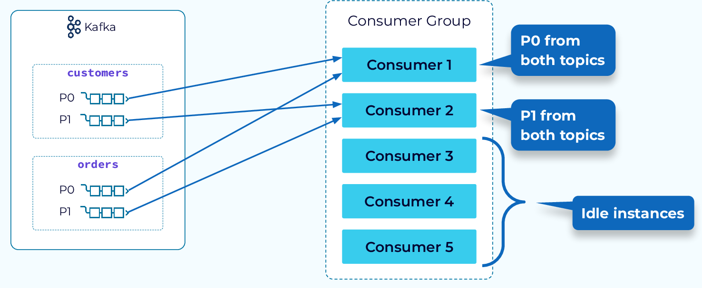

Kafka concurrency is not about threads - it's about 
partitions, ownership, and coordination.

### First Principle: Kafka Concurrency is partition-Based

One Kafka partition is consumed by only ONE Consumer threads in a consumer group
at a time.

No exceptions.

### Topic -> Partitions -> Consumers



Example:
* Topic has 6 partitions
* Consumer group has 3 consumers

**Each consumer gets 2 partitions**

### What Actually Creates Concurrency in Kafka?
❌ More threads inside one consumer

❌ Async processing without care

✅ More partitions

✅ More consumers in the same group

### Consumer Group = Logical Parallelism Unit

A Consumer group is a set of consumers that cooperatively consume partitions of a
topic, ensuring parallelism without duplication.

* Same group --> load balancing
* Different groupId -> broadcast(fan-out)

### Failing Design #1 -- “I’ll Use Multiple Threads in One Consumer”
```java
@KafkaListener(topics = "orders", groupId = "order-group")
public void listen(String message) {
    
    executor.submit(() -> process(message)); // ❌ dangerous
}

```
Why this is dangerous
* Offset commits happen in kafka thread
* Processing happens elsewhere
* Crash = message loss or duplication

### Correct Kafka Concurrency Mode
1. Multiple Consumers (BEST)
* Increase partitions
* Increase consumer instances
* Let kafka handle assignment

* safe 
* Scalable
* Predictable

2. Consumer + Worker Pool
Use one consumer thread per partition, then delegate safely

Correct pattern
```java
BlockingQueue<String> queue = new ArrayBlockingQueue<>(100);

@KafkaListener(topics = "orders", groupId = "order-group")
public void listen(String message) {
    queue.put(message); // back-pressure
}
```
Workers
```java
while (true) {
    String msg = queue.take();
    process(msg);
}
```
* Back-pressure
* Controlled parallelism
* Offset safety

### Offset Commit + concurrency

Wrong Assumption: Kafka commits offsets automatically after processing

Offset commit Timing
* Kafka commits position
* Not Business success
* Async processing breaks safety

### Exactly-Once
This is not exactly-Once
```java
process(msg);
commitOffset();
```
Crash between - duplication

Real Exactly-Once Requires
* Idempotent processing OR
* Transactional Kafka OR
* DB + Kafka transactional boundaries

### Kafka + Spring Boot Threading
Spring Kafka internals
* Each `@KafkaListener` runs on a Kafka consumer thread
* `Concurreny = N` creates N consumers
* Not In threads inside one consumer
```java
@KafkaListener(
  topics = "orders",
  groupId = "order-group",
  concurrency = "3"
)
```
* 3 consumers
* Needs >= 3 partitions


### Rebalance 

Kafka redistributes partitions when consumers join/leave

Triggers:
* Pod restart
* Scaling up/down
* Consumer crash
* Session timeout

Rebalance Side effects
* In-flight messages may repeat
* Processing pauses
* Latency spikes

### Rebalance-safe processing
* Idempotent DB Writes
* External deduplication keys
* Manual offset control
* Graceful shutdown

### Graceful Shutdown 
Bad Shutdown
* Pod killed
* Consumer dies mid-processing
* Rebalance chaos

**Correct Shutdown Pattern**
```java
@PreDestroy
public void shutdown() {
    // stop polling
    // finish processing
    // commit offsets
}
```
Spring Kafka:
* container.stop()
* AckMode.MANUAL

### back-pressure in Kafka Consumers
Without Back-Pressure
* Consumer reads too fast
* Memory spikes
* Processing lags

With Back-pressure
* Bounded queues
* Pause/resume partitions
* Controlled poll loop

### Kafka Concurrency - Design Rules
1. Partitions define max parallelism
2. One partition -> one consumer thread
3. Don't process asynchronously without back pressure
4. Don't commit offsets before processing completes
5. Rebalances WILL happen - design for them

