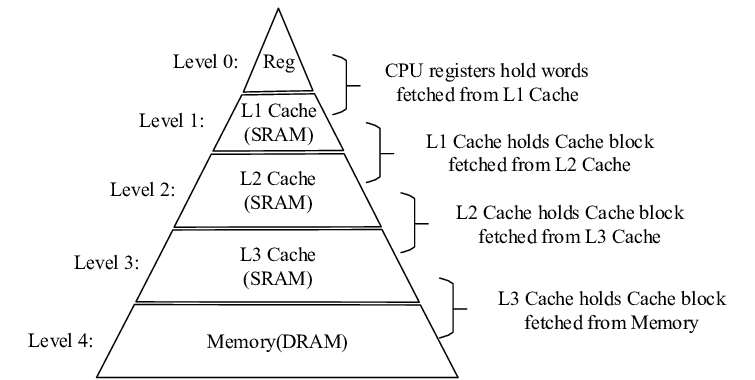
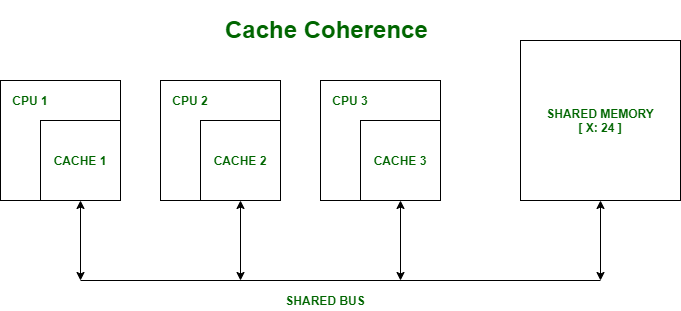
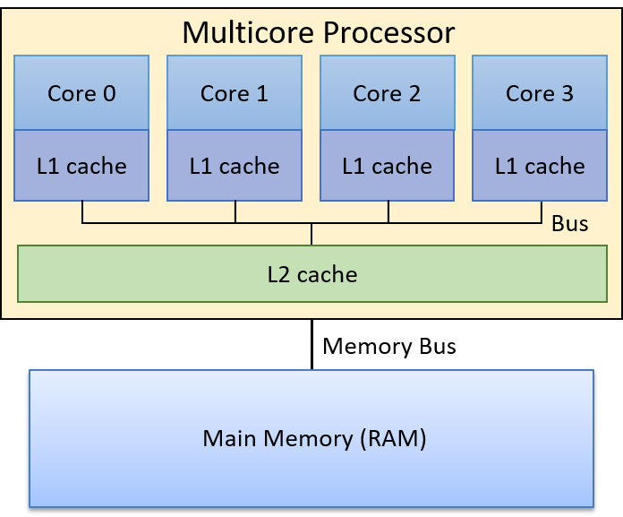

### Java Memory Model (JMM), CPU Caches, Visibility & Atomicity

#### 1. What is Java Memory Model (JMM) ?

Java Memory Model defines how and when changes made by one thread become visible to other threads, and what instruction reorderings are allowed.

JMM is :
* A Specification
* A Set of rules
* Not an implementation

#### 2. What problem Does JMM Actually solve?

Java runs on real hardware, not theory.

Modern CPUs have:
* Multiple cores
* Multiple cache levels (L1,L2,L3)
* Aggressive optimizations

without rules, threads would behave differently on different machines.

Java Memory Model (JMM) is the contract between:
* java code
* JVM
* CPU
* Hardware memory

#### 3. Hardware Reality (Even Before Even Enters)




Memory layers (Fast -> Slow)

| Layer     | Owned by |
| --------- | -------- |
| Registers | Core     |
| L1 Cache  | Core     |
| L2 Cache  | Core     |
| L3 Cache  | Shared   |
| RAM       | System   |

Key fact:

Threads do Not read RAM directly every time

They read cached copies.

#### 4. Real-world Analogy
**Office Whiteboard Analogy**
* RAM --> Company whiteboard
* CPU cache --> Employee's notebook
* Thread --> Employee
* volatile/synchronized --> Rule: "Update whiteboard before continuing"

Problem:
* Employee A writes in notebook
* Employee B reads from their own notebook
* Whiteboard never updated

**Mismatch = Visibility issue**

#### 5. Visibility Problem

Visibility means:

when one thread updates a variable, when can other threads see that update?

Failing Code #1 --- Visibility issue
```java
class VisibilityDemo{
    static boolean running = true;

    static void main() {
        
        Thread worker = new Thread(() ->{
            while (running){
                System.out.println("running");
            }
            System.out.println("Stopped");
        });
        
        worker.start();
        
        try{
            Thread.sleep(1000);
        } catch (InterruptedException e) {
            throw new RuntimeException(e);
        }
        
        running=false; // main thread updates
    }
    
}
```
What You Expect

Thread stops

What can Happen

Thread never stops

**Why This fails**
* `running` cached in worker thread's CPU
* Main thread updates RAM
* Worker never refreshes cache

**No Visibility guarantee**

**Fix Using `volatile`**
```java
static volatile boolean running =true;
```
* forces read from RAM
* Prevents cached stale reads

#### 6. Atomicity Problem

Atomicity means an operation happens completely or not at all, without interference.

Failing Code #2 -- Atomicity issue
```java
class Counter{
    static int count =0;

    public static void main(String[] args) throws InterruptedException {
        Thread t1 = new Thread(() ->{
            for (int i =0; i<10000;i++){
                count++;
            }
        });

        Thread t2 = new Thread(() ->{
            for (int i =0; i<10000;i++){
                count++;
            }
        });

        t1.start();
        t2.start();
        t1.join();
        t2.join();

        System.out.println(count);
    }
}
```
Expected Output ? `20000`

Actual Output : `1357 or any random number`

Why This Fails

`count++` is NOT atomic

Internally:
1. Read count
2. Add 1
3. Write back

Two Threads overlap --> lost updates

`volatile int count` -> does not fix this

Why?
* volatile gives visibility
* NOT atomicity

**Fix Using `Synchronized`**

```java
synchronized (Counter.class) {
    count++;
}
```
* Mutual exclusion
* Atomicity guaranteed
* Visibility guaranteed

#### 7. Instruction Reordering 

**JVM & CPU Optimization**

To improve performance
* JVM reorders instructions
* CPU reorders instructions

As long as single-thread logic looks correct

**Failing Code #3 -- Reordering + Visibility**

```java

public class ReorderingDemo {
    static boolean initialized = false;
    static int value = 0;

    static void init() {
        value = 42;
        initialized = true;
    }

    static void use() {
        if (initialized) {
            // In a reordered scenario, this could print 0!
            if (value == 0) {
                System.out.println("Bug Detected: Value is 0 even though initialized is true!");
            } else {
                System.out.println("Value: " + value);
            }
        }
    }

    public static void main(String[] args) throws InterruptedException {
        init();
        use();
    }
        // We run this in a loop because reordering is rare and non-deterministic
        /*for (int i = 0; i < 100_000; i++) {
            // Reset state
            initialized = false;
            value = 0;

            Thread t1 = new Thread(() -> init());
            Thread t2 = new Thread(() -> use());

            t1.start();
            t2.start();

            t1.join();
            t2.join();
        }
        System.out.println("Finished 100,000 iterations.");
    }*/
}
```

**What Can Happen?**

Output : `0`

Even though initialized == true;

**Why This fails**

JVM is allowed to reorder:
```java
initialized = true;
value = 42;
```
Another thread:
* Sees initialized = true
* Reads old value

**Fix with `volatile`**
```java
static volatile boolean initialized;
```
**Volatile**
* Prevents reordering
* Flushes writes to RAM

#### Summary

| Concept    | Problem          | Fix                     |
| ---------- | ---------------- | ----------------------- |
| Visibility | Stale values     | volatile / synchronized |
| Atomicity  | Partial updates  | synchronized            |
| Ordering   | Reordered writes | volatile / synchronized |

#### Key Rules
1. Threads work with CPU caches, not RAM
2. volatile == visibility + ordering
3. Synchronized = visibility + atomicity + ordering
4. Most concurrency bugs are invisible until production

#### One-Liner

Java Memory Model defines the visibility, ordering, and atomicity guarantees for shared
variables across threads, abstracting CPU cache behavior.
