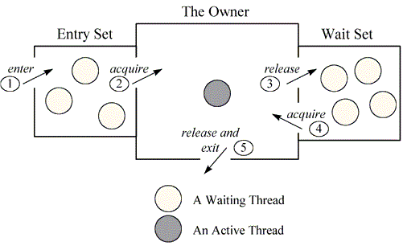

### synchronized — Deep Dive (Monitors, Locks, Visibility)

#### 1. What `synchronized` Really is?

`synchronized` is a JVM-level mutual exclusion + memory visibility mechanism implemented using object monitors.

It provides three guarantees:
1. mutual Exclusion (only one thread at a time)
2. Visibility (flushes memory)
3. Ordering (prevents reordering)

#### 2. Object Monitor

**Every Java Object has a Monitor**

That includes:
* Normal objects
* Class Objects (Myclass.class)
* this

A monitor internally has:
* Owner thread
* Entry Set (threads waiting to enter)
* Wait Set (threads that called `wait()`)


#### 3. How `synchronized` works internally

**When a Thread Enters a `syncronized` Block**
```java
synchronized (lock){
    //critical section
        }
```

JVM does:
1. Check Monitor ownership
2. if Free -> acquire
3. if owned -> move thread to BLOCKED
4. On exit -> release + flush memory

#### 4. Visibility Guarantee

**Exiting a synchronized block flushes all writes to main memory**
**Entering a synchronized block reads fresh values**

**This is a happen-before relationship**

#### Failing Code #1 -- Visibility Without `synchronized`

```java
class VisibilityFail {
    static boolean ready = false;
    static int data = 0;

    static void writer() {
        data = 42;
        ready = true;
    }

    static void reader() {
        if (ready) {
            System.out.println(data);
        }
    }
}

```
Possible Output : `0`

**Fixed with `synchronized`**
```java
static synchronized void writer() {
    data = 42;
    ready = true;
}

static synchronized void reader() {
    if (ready) {
        System.out.println(data);
    }
}
```
* Visibility guaranteed
* Ordering guaranteed

#### Atomicity Guarantee

Why `synchronized` fixes `count++`
```java
synchronized void increment() {
    count++;
}

```
* Only one thread executes inside
* No interleaving
* Entire read-modify-write is protected

#### Method VS Block Synchronization

| Feature          |Object Lock| Class Lock                           |
|------------------|-----------|--------------------------------------|
| Associated With	 | An instance of a class (this).	| The java.lang.Class object.          |
|Target Code	|Non-static synchronized methods/blocks.| 	Static synchronized methods/blocks. |
|Number of Locks |One per instance (Many).| 	One per class (One per JVM).        |
|Interference	|Threads on obj1 don't block obj2.	| Threads on obj1 DO block obj2.       |

Method-level
```java
synchronized void method() {
}

```
Equivalent to 
```java
void method() {
    synchronized (this) {
    }
}

```
Class Level lock
```java
static synchronized void method() {
}

```
Equivalent to:
```java
synchronized (MyClass.class) {
}

```

#### Failing Code #2 -- Wrong Lock Used
```java
class Counter {
    int count = 0;

    void increment() {
        synchronized (this) {
            count++;
        }
    }
}

```
Bug Scenario
* Two different `Counter` objects
* Two threads
* Both increment simultaneously
* Not Thread safe globally

**Correct if shared state is global**
```java
static int count = 0;

static synchronized void increment() {
    count++;
}

```

#### Entry Set Vs Wait Set
Entry Set
* Threads waiting to acquire lock

Wait Set
* Threads that called `wait()`
* Lock released
* Waiting for `notify()`/`notifyAll()`

#### Failing Code #3 -- Busy Waiting 
```java
synchronized void waitForFlag() {
    while (!flag) {
        // busy wait 
    }
}

```
* CPU Wastage
* Starvation

**Correct using `wait()`**

```java
synchronized void waitForFlag() throws InterruptedException {
    while (!flag) {
        wait();
    }
}

```
Add Notifier:
```java
synchronized void setFlag() {
    flag = true;
    notifyAll();
}

```

#### JVM Optimizations 
Lock States
1. Biased Lock
2. Lightweight Lock
3. Heavyweight Lock

JVM dynamically upgrades locks based on contention

#### When not to use `synchronized`
* Long running task
* blocking I/O operations
* High contention paths
* Nested locks (deadlock risk)

