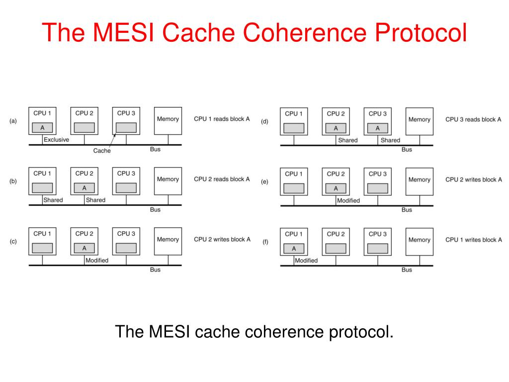
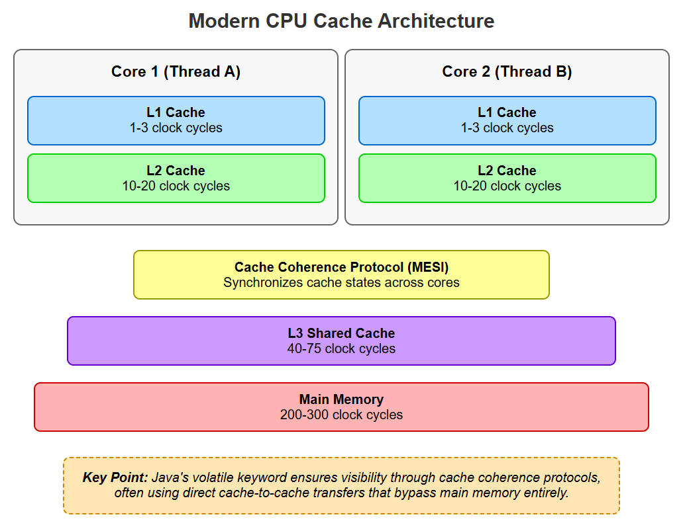

## `Volatile` -- Visibility, Ordering, and its HARD Limits

#### 1. Why `volatile` Exists(why synchronized was not Enough)

`Synchronized` gives:
* mutual exclusion
* Visibility
* Ordering

But it also:
* Blocks threads
* Causes contention
* Hurts scalability for read-heavy, write-light cases

`volatile` was introduced to solve ONLY visibility + ordering, WITHOUT locking.

#### 2. What `volatile` REALLY Means 
A `volatile` variable guarantees that reads and writes go directly to main memory
and cannot be reordered with other memory operations.

**It does not guarantee atomicity (except for single reads/writes)**

#### 3. CPU Cache Reality (Why volatile is Needed)




Without volatile:
* Thread reads from L1/L2 cache
* value may be stale

With Volatile:
* Write --> flush cache
* Read --> invalidate cache
* CPU memory barriers inserted

#### 4. Real - world Analogy (Lock Vs Volatile)

| Concept         | Meaning                                 |
| --------------- | --------------------------------------- |
| Normal variable | Personal notebook                       |
| volatile        | “Always check whiteboard before acting” |
| synchronized    | “Only one person allowed in room”       |

**Volatile = see latest**

**synchronized == control access**

#### Failing Code #1 -- Visibility Problem

```java
class VolatileFail {
    static boolean running = true;

    public static void main(String[] args) throws Exception {
        Thread worker = new Thread(() -> {
            while (running) {
                // work
            }
            System.out.println("Stopped");
        });

        worker.start();
        Thread.sleep(1000);
        running = false;
    }
}

```
** Thread may never stop

**Fix**
```java
static volatile boolean running = true;

```

#### 6. What volatile Guarantees

volatile guarantees:
* Visibility
* Ordering (prevents reordering around it)
* Atomic read/write of the variable itself

**Volatile DOES NOT Guarantee:**
* Mutual exclusion
* Atomic compound operations
* Thread safety of multiple variables

#### Failing Code #2 -- Atomicity Trap
```java
class VolatileCounter {
    static volatile int count = 0;

    public static void main(String[] args) throws Exception {
        Thread t1 = new Thread(() -> {
            for (int i = 0; i < 10000; i++) count++;
        });

        Thread t2 = new Thread(() -> {
            for (int i = 0; i < 10000; i++) count++;
        });

        t1.start();
        t2.start();
        t1.join();
        t2.join();

        System.out.println(count);
    }
}
//Output:
// 15732 (random)
```
**Why volatile fails here**

count++ == read --> modify --> write

volatile only protects read/write, not sequence.

**Correct Fix**
```java
static synchronized void increment() {
    count++;
}

```

#### 8. Instructions Reordering

**JVM & CPU Are Allowed to Reorder This:
```java
value = 42;
ready = true;

```
Into:
```java
ready = true;
value = 42;

```

#### Failing Code # 3 -- Reordering Bug
```java
class ReorderingFail {
    static boolean ready = false;
    static int value;

    static void writer() {
        value = 42;
        ready = true;
    }

    static void reader() {
        if (ready) {
            System.out.println(value); // can print 0
        }
    }
}

```

**Happens only under concurrency + load**

**Fix with volatile**
```java
static volatile boolean ready;

```
Why?
* volatile write creates Storestore + StoreLoad barriers
* All prior writes become visible

#### 10. Happens-Before Rule (Critical)
JMM Rule:

A write to a volatile happens-before every subsequent read of that same variable.

This is why volatile is safe for flags, state indicators, publication.

#### 11. Correct Use cases for volatile
* Stop flags
* initialization completion flags
* Configuration reload signal
* One-time state publication
* Double-checked locking (with volatile)

#### 12. When volatile is not enough
* Counters
* Collections
* Multiple related variables
* Check-then-act logic
* Invariants

**If logic spans more than one variable --> volatile fails**

#### 13. volatile vs synchronized

| Feature          | volatile  | synchronized            |
| ---------------- | --------- | ----------------------- |
| Visibility       | ✅         | ✅                       |
| Ordering         | ✅         | ✅                       |
| Atomicity        | ❌         | ✅                       |
| Mutual exclusion | ❌         | ✅                       |
| Blocking         | ❌         | ✅                       |
| Performance      | Very fast | Slower under contention |

