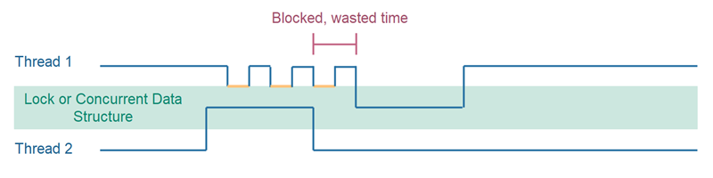
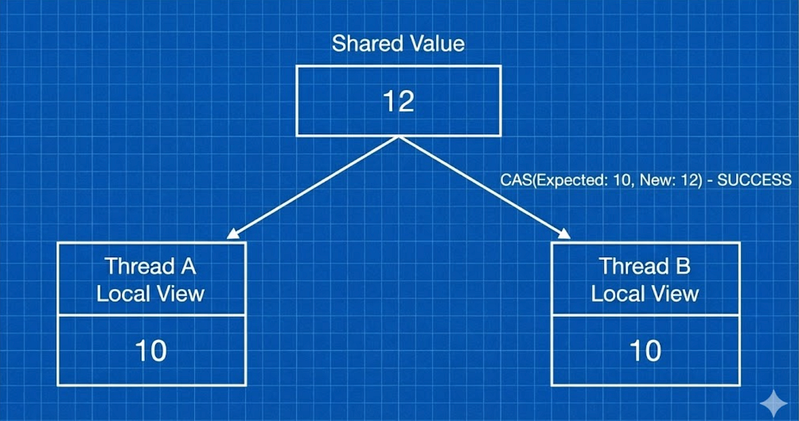
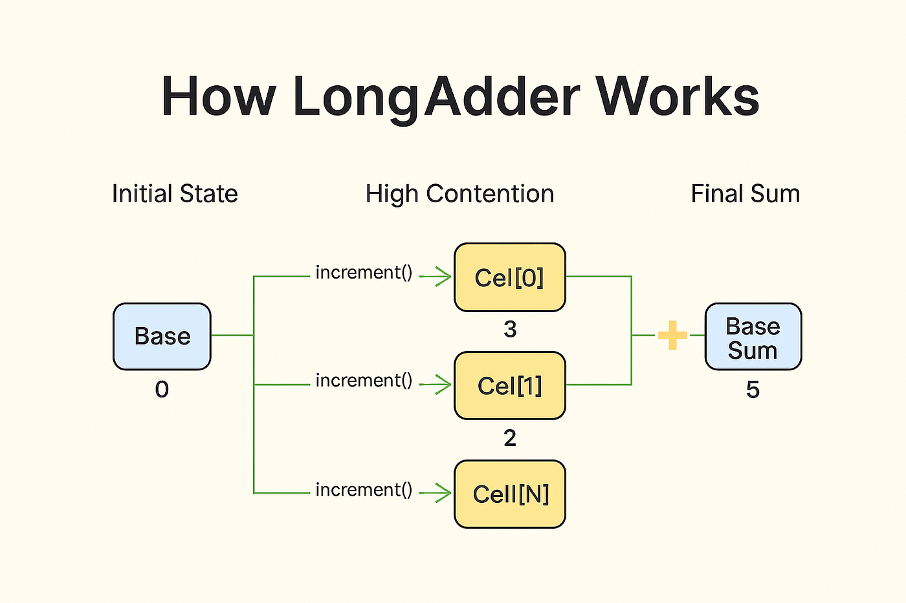

### Contention, False Sharing & LongAdder

#### 1. What is Contention?

Contention happens when multiple threads try to update the same memory location at the same time.

Examples:
* Counters
* Metrics
* Rate limiters
* statistics
* Kafka consumer lag counters

#### Why AtomicInteger Stops Scaling

AtomicInteger uses CAS.

**Under low contention**
* Very fast
* Lock-free

Under high contention
* Many threads retry CAS
* CPU spins
* Throughput drops

**What CAS looks like under load**




Each Failure:
* Burns CPU
* Causes cache invalidation
* Reduces scalability

#### The Hidden Enemy: CPU Cache Lines

Important Hardware Fact
* CPU does NOT cache single variable
* it caches cache lines (usually 64 bytes)

#### False Sharing
False sharing occurs when multiple threads modify different variables that happen to be
on the same cache line.

They are logically independent

But hardware treats them as shared

```java
class Counters{
    volatile long counter1 =0;
    volatile long counter2 = 0;
}
```
Thread A -> counter1

Thread b -> counter2

Still slow -- same cache line

Why it hurts
* Cache line invalidated repeatedly
* CPU cores fight over ownership
* Performance collapses

#### The problem statement That created `LongAdder`
**Real-world scenario**
* 50 threads increment a metric
* Exact value not needed immediately
* Throughput matters more than precision timing

AtomicInteger
* Correct But slow

synchronized:
* Correct But very slow

We need contention avoidance

#### `LongAdder`

* Don't fight over one Variable
* Split the counter into multiple independent cells.

Each Thread:
* Updates its own cell
* No contention
* Sum computed only when needed

#### Visual Model of LongAdder

* Base value
* Multiple striped cells
* Thread hashes to a cell
* Aggregation on read

#### Code Comparison: Atomic vs LongAdder

```java
import java.util.concurrent.atomic.AtomicInteger;

AtomicInteger count = new AtomicInteger();

count.incrementAndGet();
```
* CAS retries
* Cache invalidation
* Bottleneck

```java
import java.util.concurrent.atomic.LongAdder;

LongAdder counter = new LongAdder();

counter.increment();
long value = counter.sum();
```
* Almost no contention
* Scales with CPU cores
* Designed for metrics

#### Why LongAdder is Faster
* uses striped counters
* Avoids CAS retry storms
* Minimizes cache line contention
* Trades read cost for write speed

**Reads are slower (`sum()` aggregates cells)**

**Writes are extremely fast**

#### When Not to Use LongAdder 

When you need:
* Exact value at every movement
* Strong consistency
* Compare-and-set logic

```java
if (counter.get() == 10) { ... } // NOT SAFE
```
LongAdder is eventual consistency

#### AtomicInteger vs LongAdder 

| Scenario        | Use           |
| --------------- | ------------- |
| Low contention  | AtomicInteger |
| High contention | LongAdder     |
| Precise checks  | AtomicInteger |
| Metrics / stats | LongAdder     |
| Rate counters   | LongAdder     |

#### False Sharing vs Contention 

| Problem       | Cause           | Fix                |
| ------------- | --------------- | ------------------ |
| Contention    | Same variable   | LongAdder          |
| False sharing | Same cache line | Padding / striping |

#### Real world usages
* Metrics counters
* Monitoring systems
* Request rate tracking
* Kafka lag aggregation
* High-volume logging stats

