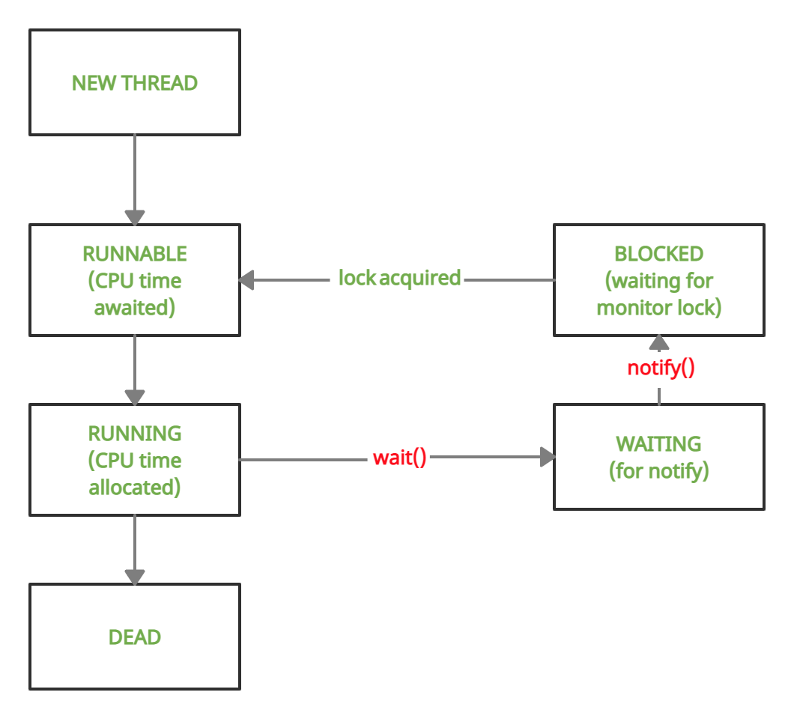

### Thread Lifecycle, Blocking, Waiting & Coordination

#### Thread Lifecycle


Thread States 

| State         | Meaning                    |
| ------------- | -------------------------- |
| NEW           | Created, not started       |
| RUNNABLE      | Ready or running on CPU    |
| BLOCKED       | Waiting for a monitor lock |
| WAITING       | Waiting indefinitely       |
| TIMED_WAITING | Waiting with timeout       |
| TERMINATED    | Finished execution         |

#### Blocking Vs Waiting 

**BLOCKED**
* Waiting to acquire a lock
* Caused by synchronized
```java
synchronized (lock){
    //
        }
```
**WAITING**
* Thread voluntarily pause
* Releases the lock
* waits for signal
```java
wait();
```

#### Busy Waiting
```java
while(!condition){
    //spin
        }
```

Problems:
* Burns CPU
* Starves other threads
* No memory visibility guarantee

#### wait() / notify() 
Rule:
1. wait() must be called inside synchronized
2. wait() releases the lock
3. notify() wakes one thread
4. notifyAll() wakes all
5. Woken thread must re-acquire lock



#### Failing Code #1 -- illegalMonitorStateException
```java
class Demo {
    void wrongWait() throws InterruptedException {
        wait(); 
    }
}

```
* Thread does not own the monitor

**Correct usage**
```java
synchronized void correctWait() throws InterruptedException {
    wait();
}

```

#### Failing Code #2 -- Missed Signal

```java
class SignalBug {
    boolean ready = false;

    synchronized void waitForReady() throws InterruptedException {
        if (!ready) {
            wait(); // ❌
        }
    }

    synchronized void setReady() {
        ready = true;
        notify();
    }
}

```
**What Can Happen**
* notify happens before wait
* Thread waits forever

**Correct Pattern Always use WHILE**
```java
synchronized void waitForReady() throws InterruptedException {
    while (!ready) {
        wait();
    }
}

```
**Always wait in loop never in if**

#### notify vs notifyAll
notify()
* Wakes one arbitrary thread
* Risky with multiple conditions

notifyAll()
* Wakes all waiting threads
* Safer
* Slightly more CPU

#### Sleep() vs wait()

| Feature            | sleep()      | wait()       |
| ------------------ | ------------ | ------------ |
| Releases lock      | ❌            | ✅            |
| Needs synchronized | ❌            | ✅            |
| Purpose            | Pause thread | Coordination |
| Wakes on notify    | ❌            | ✅            |
