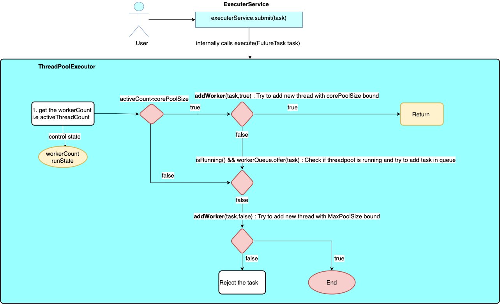

### Executors & Thread Pools (Internals, Queues, Sizing)

Creating threads is easy.

Managing threads under load is hard.

#### Why Raw Threads Fail in Real Systems

**Naive Approach**

```java
new Thread(() -> handleRequest()).start();
```

Problems:
* Unlimited thread creation
* Memory exhaustion (each thread has a stack)
* CPU context-switching storm
* No back-pressure
* JVM crashes under load

Threads are expensive.

Reuse is mandatory.

#### What is an Executor?

An Executor separates task submission from task execution.

You Submit what to do

Executor decides how & when

#### Thread Pool Mental Model


Components:
* Task Queue
* Worker Threads
* Pool Controller

Threads:
* Created once
* Reused many times
* Destroyed based on rules

#### ExecutorService

````java
import java.util.concurrent.ExecutorService;

ExecutorService executorService = Executors.newFixedThreadPool(3);

executorService.submit(() -> {
    System.out.println(Thread.currentThread().getName());
        });

executorSerivice.shutdown();
````
* No thread explosion
* Controlled concurrency
* Graceful shutdown

#### Core executor internals

All executors are built on ThreadpoolExecutor

Constructor
```java
ThreadPoolExecutor(
        int corePoolSize,
        int maximumPoolSize,
        long keepAliveTime,
        TimeUnit unit,
        BlockingQueue<Runnable> workQueue,
        ThreadFactoy threadFactoy,
        RejectedExecutionHandler handler
)
```

#### Thread pool lifeCycle

Task Submission flow

1. if running threads < corePoolSize --> created thread
2. Else -> enqueue task
3. if queue full AND threads < maxPoolSize --> create new threads
4. Else -> reject task

#### Thread Pool Parameters

1. corePoolSize
   * minimum number of threads
   * Always kept alive
2. maximumPoolSize
   * Maximum allowed threads
   * used only when queue if full
3. KeepAliveTime
   * Idle time before extra threads die

#### Queue types(Make or Break performance)

1. LinkedBlockingQueue

```java
import java.util.concurrent.LinkedBlockingDeque;
new LinkedBlockingDeque<>();
```
* Unbounded 
* Risk of OOM
* Stable throughput

2. ArrayBlockingQueue

```java
import java.util.concurrent.ArrayBlockingQueue;
new ArrayBlockingQueue<>();
```
* Bounded 
* Predictable memory
* Back-pressure

3. SynchronousQueue

```java
import java.util.concurrent.SynchronousQueue;
new SynchronousQueue<>();
```
* no Storage
* Direct handoff
* High throughput
* High rejection risk

#### Rejection Policies

| Policy              | Behavior         |
| ------------------- | ---------------- |
| AbortPolicy         | Throw exception  |
| CallerRunsPolicy    | Caller executes task |
| DiscardPolicy       | Silent drop      |
| DiscardOldestPolicy | Drop oldest task |

`callerRunsPolicy` provide natural back-pressure

#### ThreadFactory

Why ThreadFactory
* Thread naming
* daemon threads
* debugging
* Monitoring

```java
ThreadFactory factory = r -> {
    Thread t = new Thread(r);
    t.setName("order-worker");
    return t;
};

```
#### Executor shutdown

Wrong
```java
executor.shutdown(); // without waiting

```
Correct
```java
executor.shutdown();
executor.awaitTermination(10, TimeUnit.SECONDS);
```
or Force
```java
executor.shutdownNow();

```
executor.shutdownNow(); -> interrupt threads.

#### Thread Pool sizing
CPU-Bound Tasks
```text
threads = number of cores
```
IO-Bound Tasks
```text
threads = cores / (1 - blocking coefficient)
```
Example:
* 8 cores
* 80% blocking

**8/(1-0.8) = 40 threads

#### Failing Code --- Unbounded Queue
```java
Executors.newFixedThreadPool(10);
```
Uses unbounded LinkedBlockingQueue

Under heavy load:
* Task pile up
* Memory leak
* OOM

Always create ThreadPoolExecutor manually.

```java
ExecutorService executor =
    new ThreadPoolExecutor(
        10,
        20,
        30,
        TimeUnit.SECONDS,
        new ArrayBlockingQueue<>(100),
        Executors.defaultThreadFactory(),
        new ThreadPoolExecutor.CallerRunsPolicy()
    );

```
* Bounded
* Predictable
* Back-pressure enabled

#### Mental Model

Thread pool = CPU budget manager

if you overspend:
* Latency spikes
* GC pressure
* Pod restarts

